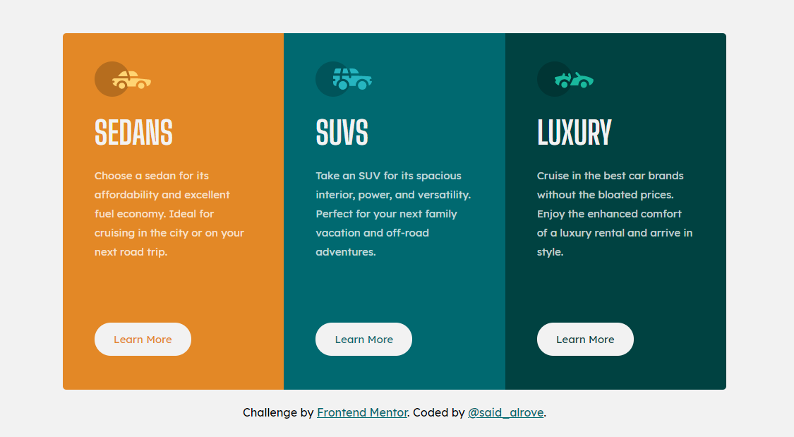

# Frontend Mentor - 3-column preview card component solution
This is a solution to the [3-column preview card component challenge on Frontend Mentor](https://www.frontendmentor.io/challenges/3column-preview-card-component-pH92eAR2-). Frontend Mentor challenges help you improve your coding skills by building realistic projects. 

> **Note:** in order to avoid large names, the URL of this project is an abbreviation of the name of this repository (three-columns-card-sass -> tccs) with its unique ID (for less problems with names already taken).

## Screenshot

## Links

- [Frontend Mentor](https://www.frontendmentor.io/solutions/3columncard-component-with-sass-using-the-smacss-methodology-M5rZwsCyJ)
- [Netlify](https://tccs-81fc40.netlify.app/)

## Author

- Frontend Mentor - [@said-alrove](https://www.frontendmentor.io/profile/said-alrove)
- Twitter - [@said_alrove](https://twitter.com/said_alrove)

